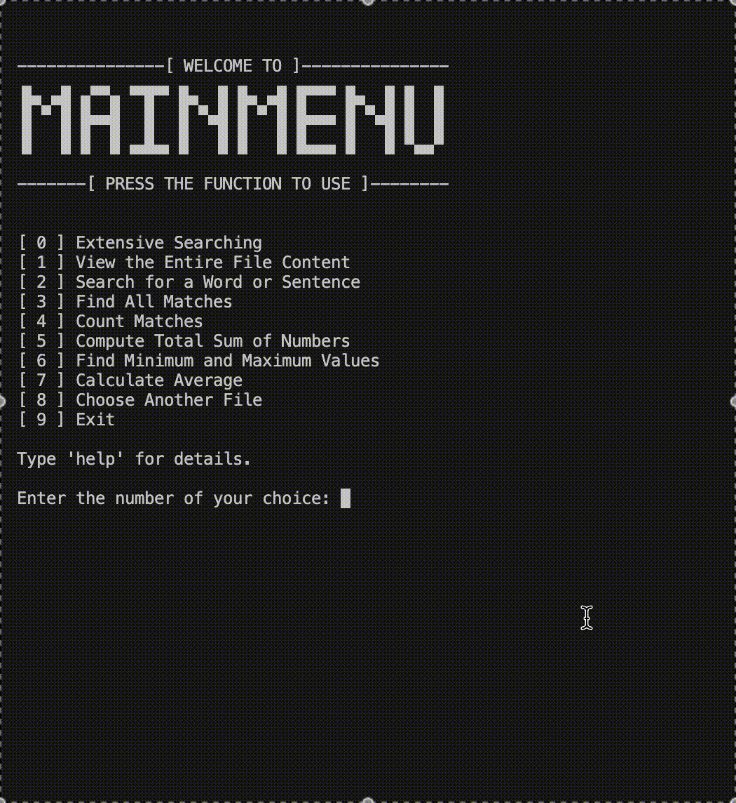

# **FindThon**  
**FindThon: Python Console-Based Text Finder Using Regex**  

  

## **Project Overview**  
FindThon is a Python console application that uses the re module to implement the power of regular expressions for sophisticated text analysis and processing. It serves as an educational tool for understanding pattern matching while providing practical text analysis capabilities. The project aligns with many key educational and practical objectives:  

- **Text Analysis Education**  
  Helping users understand regular expressions and pattern matching  

- **Data Processing**  
  Enabling efficient analysis of numerical and textual data  

- **Pattern Recognition**  
  Supporting advanced search capabilities through regex  

- **Statistical Analysis**  
  Providing mathematical operations on numerical data  

  

## **Features**  
FindThon offers comprehensive text analysis capabilities through the following functionalities:  

| **Feature** | **Description** |
|-------------|----------------|
| **Extensive Searching** | Advanced search options for both strings and numbers on a line-by-line basis |
| **View Content** | Display complete and full file contents for analysis |
| **Single Match Search** | Find first occurrences of words or sentences |
| **Multiple Match Search** | Locate all instances of search patterns |
| **Match Counter** | Calculate total occurrences of patterns |
| **Numerical Analysis** | Compute sums, averages, and find min/max values |
| **File Management** | Switch between different text files for analysis |

  
  
  
  
  
  
  
  
  

  

## **How Extensive Searching Works**  

### **String Search Conditions**  
The application provides 10 different string search patterns:  
  

1. **Exact Match**  
   - Matches the exact word or phrase  
   - **Example:** Searching for `"apple"` will match `"apple"` but not `"Apple"` or `"apples"`  
   - **Regex:** `r"\bapple\b"`  

2. **Case-Insensitive Match**  
   - Matches word/phrase regardless of case  
   - **Example:** Searching for `"hello"` will match `"Hello"`, `"HELLO"`, and `"hElLo"`  
   - **Regex:** `r"(?i)hello"`  

3. **Whole Word Match**  
   - Finds full words only  
   - **Example:** Searching for `"cat"` will match `"cat"` but not `"cats"` or `"cattle"`  
   - **Regex:** `r"\bcat\b"`  

4. **Words Starting With a Letter**  
   - Matches words that start with a specific letter  
   - **Example:** Searching for `"A"` will match `"Apple"`, `"Air"`, `"Awesome"`  
   - **Regex:** `r"\b[Aa]\w*"`  

5. **Words Ending With a Letter**  
   - Matches words ending with a specific letter  
   - **Example:** Searching for `"d"` will match `"word"`, `"speed"`, `"closed"`  
   - **Regex:** `r"\w*[dD]\b"`  

6. **Words Containing a Substring**  
   - Finds words that contain a specific substring  
   - **Example:** Searching for `"sun"` will match `"sunlight"`, `"sunny"`, `"sunrise"`  
   - **Regex:** `r"\b\w*sun\w*\b"`  

7. **Alphanumeric Words Only**  
   - Matches words containing only letters and numbers  
   - **Example:** Matches `"abc123"`, `"hello2000"`, but not `"hello@world"`  
   - **Regex:** `r"\b[a-zA-Z0-9]+\b"`  

8. **Words of Specific Length**  
   - Matches words of a given length  
   - **Example:** Searching for `5` will match `"apple"`, `"grape"`, `"table"`  
   - **Regex:** `r"\b\w{5}\b"`  

9. **Words with Special Characters**  
   - Matches words with special characters  
   - **Example:** Matches `"hello!"`, `"@mention"`, `"#hashtag"`  
   - **Regex:** `r"\b\w*[^a-zA-Z0-9\s]\w*\b"`  

10. **Words with Numbers**  
    - Matches words containing at least one number  
    - **Example:** Matches `"h3llo"`, `"password123"`, `"4ever"`  
    - **Regex:** `r"\b\w*\d\w*\b"`  

### **Number Search Conditions**  
Offers 10 specialized numerical search patterns:  

1. **0-100**  
   - Matches numbers from 0 to 100  
   - **Example:** Matches `"0"`, `"25"`, `"100"`, but not `"101"`  
   - **Regex:** `r"\b(?:[1-9]?[0-9]|100)\b"`  

2. **Even only**  
   - Matches even numbers  
   - **Example:** Matches `"2"`, `"14"`, `"100"`  
   - **Regex:** `r"\b\d*[02468]\b"`  

3. **Odd only**  
   - Matches odd numbers  
   - **Example:** Matches `"1"`, `"33"`, `"99"`  
   - **Regex:** `r"\b\d*[13579]\b"`  

4. **Decimals only**  
   - Matches floating-point numbers  
   - **Example:** Matches `"3.14"`, `"0.5"`, `"100.99"`  
   - **Regex:** `r"\b\d+\.\d+\b"`  

5. **Percentages only**  
   - Matches numbers with % symbol  
   - **Example:** Matches `"5%"`, `"100%"`, `"42.5%"`  
   - **Regex:** `r"\b\d+%"`  

6. **Numbers with Leading Zeros**  
   - Finds numbers starting with zeros  
   - **Example:** Matches `"007"`, `"000123"`, `"0456"`  
   - **Regex:** `r"\b0+\d+\b"`  

7. **Positive Numbers only**  
   - Matches numbers greater than zero  
   - **Example:** Matches `"1"`, `"99"`, `"500"`  
   - **Regex:** `r"\b[1-9]\d*\b"`  

8. **Negative Numbers only**  
   - Matches numbers less than zero  
   - **Example:** Matches `"-1"`, `"-100"`, `"-500"`  
   - **Regex:** `r"-\b\d+\b"`  

9. **Consecutive Increasing or Decreasing Numbers**  
   - Matches increasing/decreasing sequences  
   - **Example:** Matches `"123"`, `"4567"`, `"987"`  
   - **Regex:** `r"\b(?:123|234|345|456|567|678|789|987|876|765|654|543|432|321)\b"`  

10. **Numbers containing a Specific Digit**  
    - Matches numbers containing particular digits  
    - **Example:** For digit `"5"`: matches `"5"`, `"15"`, `"50"`, `"500"`  
    - **Regex:** `r"\b\d*[5]\d*\b"`  

## **Prerequisites**  
Required setup for running FindThon:  
- **Python** (latest version recommended)  
- **Basic understanding of regular expressions**  
- **Text editor or IDE**  
- **Text files for analysis**  

## **Installation**  
1. Download the FindThon source code
2. Ensure Python is installed on your system
3. Run the program through your preferred Python environment
4. Have text files ready for analysis
5. Text files and py files must be in the same directory

## **About the Developer**  
Developed by Jhon Lloyd Valencia, a first-year computer science student majoring in Software Engineering. This project is in compliance with second semester's preliminiary output under the subject Computer Programming II however, FindThon also represents an exploration into text processing and pattern matching, demonstrating the practical application of regular expressions in data analysis while implementing Object Oriented Programming Principles into practice.

The project showcases the developer's growing expertise in:  
- Regular Expressions  
- Python Programming  
- Console Application Development  
- Text Processing  
- Data Analysis  

---

For suggestions, improvements, or questions about my project "FindThon", feel free to reach out to the developer :)

## **Let's Connect!**  
- 📧 **Email**: jhonlloydval@gmail.com  
- 🐙 **GitHub**: [jhonlloydval](https://github.com/jhonlloydval)  
- 🚀 **LinkedIn**: [jhonlloydval](https://linkedin.com/in/jhonlloydval)  
- 📸 **Instagram**: [jhonlloydval](https://instagram.com/jhonlloydval)  
